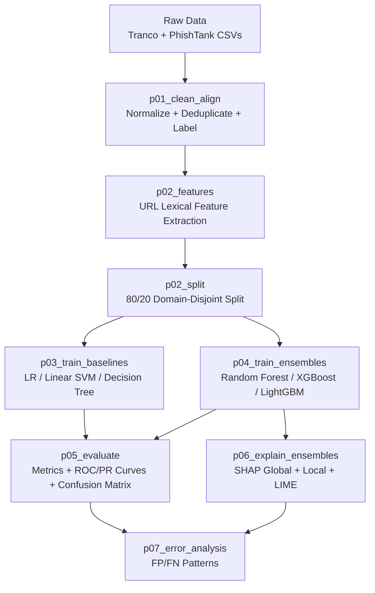

# PhishXAI

PhishXAI is a reproducible, modular, and fully explainable machine learning pipeline for classifying phishing URLs using lexical (URL-only) features. It supports both **single classifiers** and **ensemble models**, with **SHAP** and **LIME** explanation layers applied to ensembles.

---

## 🎯 Features

- **Lexical Feature Extraction**: URL-only features (no content analysis)
- **Multiple Classifiers**: Logistic Regression, Linear SVM, Decision Tree, Random Forest, XGBoost, LightGBM
- **Ensemble Models**: Advanced tree-based models with hyperparameter tuning
- **Explainability**: SHAP (global + local) and LIME explanations for ensemble models
- **Domain-Disjoint Splits**: Prevents data leakage between train/test sets
- **Reproducible Experiments**: Timestamped runs with configuration snapshots
- **Comprehensive Evaluation**: ROC-AUC, PR-AUC, confusion matrices, error analysis

---

## ⚙️ Requirements

- **Python**: 3.11+ (built and tested with 3.12.11)
- **Poetry**: 2.2.1+ (recommended)
- **OS**: Windows/macOS/Linux

> **Note**: Python 3.13 may have delayed wheel availability for XGBoost/LightGBM.

---

## 🚀 Installation & Setup

### 1️⃣ Clone the Repository
```bash
git clone https://github.com/eshaibu/phishxai.git
cd phishxai
```

### 2️⃣ Install Dependencies

#### Option A: Using Poetry (Recommended)
```bash
make setup
```
Or manually:
```bash
poetry install
eval $(poetry env activate)  # activate the virtual environment (bash/zsh/csh)
```
> **Note**: For other shells (fish, PowerShell, etc.), see [Poetry's environment activation guide](https://python-poetry.org/docs/managing-environments/#activating-the-environment).

#### Option B: Using requirements.txt
If you prefer pip or don't have Poetry:
```bash
poetry export -f requirements.txt --output requirements.txt --without-hashes
pip install -r requirements.txt
```

### 3️⃣ Add Raw Datasets
Place your CSV datasets in `data/raw/`:
```
data/raw/
    phishtank.csv
    tranco.csv
```

**Expected Columns:**

- **PhishTank**: `phish_id`, `url`, `submission_time`, `verification_time`, `target` (optional)
- **Tranco**: Two-column CSV where column 2 = domain
  ```
  rank,domain
  1,google.com
  2,youtube.com
  ```

---

## 🔧 Usage

### Quick Start: Run Individual Pipelines

The Makefile provides convenient commands for running individual pipeline stages:

```bash
# Clean and align raw datasets
make clean-align

# Extract lexical features
make extract-features

# Split into train/test sets
make split-data

# Train baseline classifiers
make train-baselines

# Train ensemble models
make train-ensembles

# Evaluate all models
make evaluate

# Generate SHAP + LIME explanations
make explain

# Perform error analysis
make error-analysis

# Generate model configuration table
make model-configs
```

### Run Complete Pipeline

To execute all pipelines in sequence:
```bash
make run-pipelines
```

This will:
1. Clean + align datasets
2. Extract lexical URL features
3. Split into train/test (domain-disjoint)
4. Train all baseline + ensemble models
5. Evaluate and generate metrics
6. Produce SHAP + LIME explanations
7. Create model configuration tables
8. Perform error analysis

### Other Useful Commands

```bash
# Clean generated data and reports
make clean

# View all available commands
make help
```

---

## 🔁 Pipeline Overview

The pipeline consists of 7 modular stages:



### Pipeline Stages

| Pipeline | Description |
|----------|-------------|
| `p01_clean_align` | Normalizes raw CSVs, deduplicates, prevents domain leakage |
| `p02_features` | Extracts lexical URL features (length, special chars, entropy, etc.) |
| `p02_split` | Creates domain-disjoint 80/20 train/test split |
| `p03_train_baselines` | Trains Logistic Regression, Linear SVM (calibrated), Decision Tree |
| `p04_train_ensembles` | Trains Random Forest, XGBoost, LightGBM with hyperparameter tuning |
| `p05_evaluate` | Generates metrics, ROC/PR curves, confusion matrices |
| `p06_explain_ensembles` | Produces SHAP and LIME explanations for ensemble models |
| `p07_error_analysis` | Analyzes false positive/negative patterns |

---

## 📁 Project Structure

```
phishxai/
├── pyproject.toml              # Poetry configuration
├── requirements.txt            # Exported dependencies
├── Makefile                    # Automation commands
├── README.md
│
├── data/
│   ├── raw/                    # Place raw Tranco + PhishTank CSVs here
│   ├── interim/                # Cleaned, aligned, feature-engineered CSVs
│   └── processed/              # Train/test splits (domain-disjoint)
│
├── experiments/
│   ├── configs/                # YAML experiment configurations
│   │   ├── starter.yaml
│   │   └── baseline.yaml
│   └── runs/                   # Timestamped experiment outputs
│
├── models/                     # Saved models (.joblib) + metadata.yaml
│
├── reports/
│   ├── tables/                 # metrics.csv, model_configs.csv, errors_*.csv
│   └── figures/                # ROC/PR curves, SHAP, LIME, confusion matrices
│
├── src/
│   └── irp_phishxai/
│       ├── cli/                # CLI wrappers for pipelines
│       ├── pipelines/          # p01-p07 pipeline implementations
│       ├── utils/              # IO, plotting, model helpers
│       └── config.py           # Configuration loader
│
└── tests/                      # Unit tests
```

---

## 📊 Evaluation Metrics

The pipeline reports comprehensive performance metrics:

| Metric | Description |
|--------|-------------|
| **Accuracy** | Overall proportion of correct predictions |
| **Macro-F1** | Harmonic mean of precision/recall (equal weight per class) |
| **ROC-AUC** | Model's ability to separate phishing vs. benign at any threshold |
| **PR-AUC** | Precision-Recall tradeoff (important for imbalanced datasets) |
| **FPR@TPR=0.95** | False positive rate when catching 95% of phishing URLs |
| **Confusion Matrix** | Breakdown of TP/FP/TN/FN |

These metrics support evaluation of classifier performance and operational trade-offs.

---

## 🔍 Outputs & Reproducibility

Every experiment generates:

### ✓ Timestamped Run Folder
```
experiments/runs/2025-02-15_14-32-11/
    config_snapshot.yaml
    baseline_training.yaml
experiments/runs/2025-02-15_14-33-15/
    config_snapshot.yaml
    ensemble_training.yaml
```

### ✓ Metrics & Tables
- `reports/tables/metrics.csv` - Performance metrics for all models
- `reports/tables/model_configs.csv` - Hyperparameter configurations
- `reports/tables/errors_*.csv` - Error analysis per model

### ✓ Visual Artifacts
- SHAP global bar charts
- SHAP beeswarm summaries
- SHAP waterfall plots (local explanations)
- LIME local explanations
- ROC/PR curves
- Confusion matrices
- Runtime trade-off plots

### ✓ Feature Manifest
The feature list used for training is preserved in:
```
data/interim/features_full.csv
```

This ensures every experiment is fully reproducible.

---

## 🧪 Advanced Usage

### Running with Custom Configs

```bash
# Build dataset with custom config
poetry run python -m src.cli.build_dataset --config experiments/configs/custom.yaml

# Train specific models only
poetry run python -m src.cli.train --config experiments/configs/starter.yaml --which rf xgb

# Evaluate with custom config
poetry run python -m src.cli.evaluate --config experiments/configs/starter.yaml

# Explain specific ensemble model
poetry run python -m src.cli.explain --config experiments/configs/starter.yaml

# Error analysis for specific model
poetry run python -m src.cli.error_analysis --config experiments/configs/starter.yaml --model_key xgb
```

### Configuration Files

Experiment configurations are stored in `experiments/configs/` as YAML files. Key settings:

- Dataset paths and sampling parameters
- Feature extraction options
- Train/test split ratios
- Model hyperparameters
- Evaluation thresholds

---